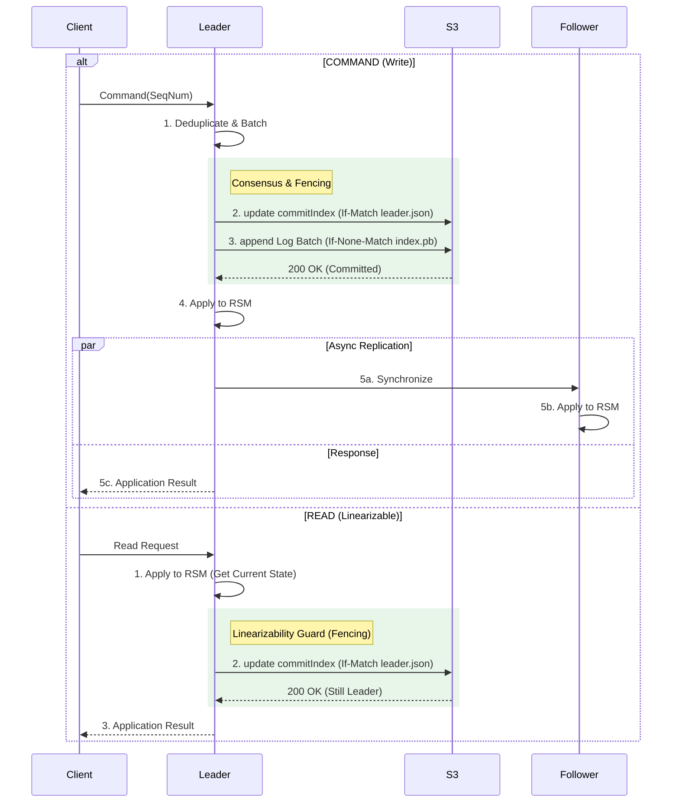
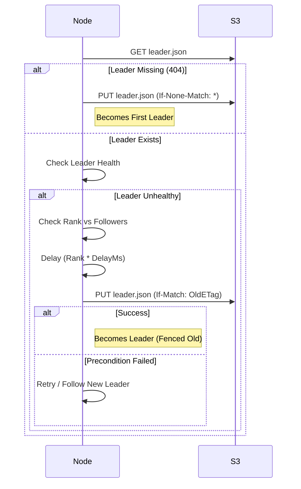
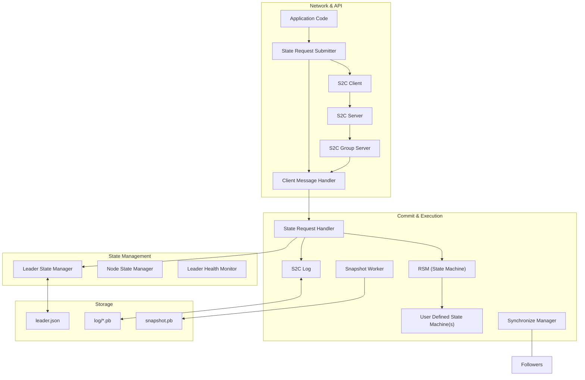
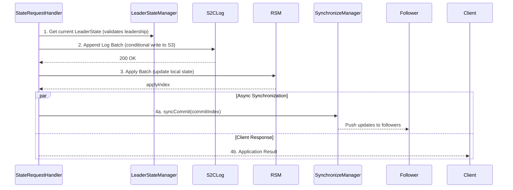

# S2C Deep Dive

Welcome to S2C's deep dive guide. This document aims to provide a comprehensive deep dive into S2C's internals.

---

## Overview

S2C is a state machine replication (SMR) system built on top of AWS S3 with two primary goals.

First, to achieve distributed consensus by leveraging S3’s strong consistency guarantees CAS-like semantics (conditional writes), eliminating the need to manage quorums of nodes.

Second, to introduce an abstraction layer over S3 that enables it to be used as a strongly consistent CP system with richer semantics for managing structured state, rather than merely as an opaque object store.

To achieve consensus, S2C relies on a fencing-based model that enables distributed coordination in a cluster of nodes without requiring quorum to be available. As a result, the system can maintain strong consistency and liveness with a single available node, and can fully recover its state even after all nodes have been shut down.

Building on this model, S2C implements replicated state machines directly atop S3. This not only provides a quorum-less CP distributed system, but also effectively turns S3 into a versatile state management substrate, capable of supporting one or more custom state machines that expose a consistent interface across a distributed cluster.

## Motivation

Object storage has become a foundational component of modern cloud architectures. Although originally designed to store unstructured data, its durability, availability, cost efficiency, and operational simplicity have made it increasingly attractive as a building block for more sophisticated systems.

As a result, many teams attempt to use object storage to avoid the operational complexity and cost of running quorum-based systems that implement replicated state machines. However, object storage exposes only minimal semantics. To compensate, teams often introduce fragile patterns such as time-based leases or external coordination, reintroducing much of the complexity they were trying to avoid.

At the same time, replicated state machines are no longer optional for many systems. They are critical for coordinating and managing complex application state, yet remain difficult and expensive to operate.

S2C addresses this gap by providing a quorum-less replicated state machine directly on top of S3. By significantly simplifying operations while preserving strong consistency and durability, S2C enriches object storage semantics and enables its use for far more complex data and state management workloads without the burden of operating quorum-based systems.

### S3 as the shared storage

S3 is a fundamental cloud primitive and is widely treated as the de facto standard interface for object storage due to its strong consistency, durability, and availability guarantees.

Importantly, S2C is not intrinsically tied to S3 itself, but to these guarantees. Any shared storage system that is strongly consistent and supports conditional writes can serve as the consensus substrate described in this document. This is the origin of the term Shared Storage Consensus.

In practice, however, durability is essential. Without it, durability would need to be reintroduced via quorum-based replication, negating the core benefit of S2C. Because S3 already provides strong consistency, durability, availability, and CAS semantics, it represents the most practical shared storage backend for this design.

Throughout this document, S3 is therefore used as a shorthand for any storage system offering equivalent guarantees.

### Goals and Non-goals

1. S2C aims to provide an operationally simple, quorum-less, fault-tolerant, highly available and durable, and strongly consistent, replicated state machine where ease of maintenance and deployment is prioritized over raw latency.

2. It is not a goal for S2C to be a general-purpose replacement for quorum-based consensus for all use cases, especially where S3 or an S3-compatible storage is not available.

---

## 1 Protocol

To get started, we first explain the lifecycle of an S2C node.

A node interested in joining an S2C cluster, must first be able to discover the *`LeaderState`*. The `LeaderState` is a view into the replicated state machine's configuration at a given point in time. It includes:

- The leader's identity (an identifier with the host and port of the leader node).
- The commit index of the log.
- The list of followers of the given epoch.

The `LeaderState` is stored in S3 as a single object and is only updated (mutated or not) using S3's CAS semantics (conditional writes). **Whichever node **successfully updates it**, is the leader.** It should ideally be serialized in a human-readable format (e.g. JSON), which should not impose a performance problem, given its small size.

To join the cluster, the node enters a join loop:

1. The node tries to **discover** the leader by looking up the `LeaderState`.

2. If `LeaderState` is found, it compares the leader identity with its own identity, if they match, the node is leader and is considered joined, otherwise it tries to follow the leader. On success, it has joined as a follower.

3. If the leader was not responding after retries, or if the `LeaderState` was not found, the node **checks** the leader state then goes back to 1. Checking `LeaderState` is detailed in Section 2.5.2.

### 1.1 Node's lifecycle

An S2C node can be in one of two states:

* `JOINING`
* `JOINED`

The states transition as follows:

`JOINING` -> `JOINED` -> `JOINING`

And when it is joined, it has one of two roles:

* `LEADER`
* `FOLLOWER`

Note that the node's role is only **settled** when it is `JOINED`. Before that, the node is `JOINING` and its role is undetermined. This is because even if it was inferred from the `LeaderState` that the node is not leader, it can still attempt leadership if the inferred leader is not responsive. Only when the node is `JOINED`, it can behave based on its role, i.e. leader or follower.

`JOINING` is the initial state. It represents the discovery phase, where the node tries to discover the replicated state machine's configuration, i.e. `LeaderState` and follows the leader, or initiate it if it is the first node, which transitions it to `JOINED` if successful.

`JOINING` can involve a **catch-up** step too, where the node rebuilds its state independently from S3, if: 

1. The node's identity doesn't match the node identity found in`LeaderState` *AND* the node is marked as *too far behind*. (More on this below).

2. Or, the node's identity matches the node identity found in`LeaderState`.

When the node is `JOINED`, it can transition to `JOINING` again when the node is follower and it has either:

1. Missed a given number of heartbeats from the leader: in this case, the nodes *wipes out (resets)* its `LeaderState` and transitions to `JOINING`. This causes the node to behave as a new node and should eventually join the cluster again.

2. It lags so far behind, that the leader cannot synchronize it from the log: this goes the same way as 1, with the difference that before transitioning to `JOINING`, the node marks itself as *too far behind* which should cause the `JOINING` state to involve the catch-up step.

### 1.2 RPCs

S2C defines a minimal set of RPCs:

- `StateRequest`: a request issued by any node *that is already part of the cluster* to *mutate* (COMMAND) or *query* (READ) the RSM's state. An accepted request is handled only by the leader's RSM.

- `StateRequestResponse`: a response to a StateRequest.

- `Follow`: a request issued by any node *that is not part of the cluster* to the leader to be recognized as follower.

- `FollowResponse`: a response to a Follow request.

- `SynchronizeRequest`: a request issued by the leader to a follower to synchronize the leader's RSM state. It includes a committed batch with its commit index.

- `SynchronizeResponse`: a response from a follower to a SynchronizeRequest that includes the commit index of the last enqueued batch for application. If the commit index is of a truncated batch, the leader informs the follower that it is *too far behind* and should *catch up* on its own (see Section 2.1).

- `Handshake`: Initiated by any node willing to open a connection with another node (e.g. a new node willing to open a connection with the leader to issue a Follow request, or a leader willing to open a connection with a follower to issue a SynchronizeRequest).

The next section details the lifecycle of a StateRequest.

### 1.3 State Request's Lifecycle

1. **Submission**: An application submits a request on any node.

2. **Forwarding**: If the node is a follower, it forwards the request to the leader, otherwise it is forwarded to the handling path of the node, on which it handles RPCs incoming over the network.

3. **Batching**: The leader accumulates requests by `StateRequestType` (`READ` or `COMMAND`, each type through a different batching and handling path). A batch is then released for handling after either a flush interval ends, or a minimum size is reached, whichever happens first.[^6]

We divide handling of state requests in two paths, depending on the request’s type:

#### 1.3.1 `COMMAND` Requests (Writes)

1. **Commit**: 
   - When a batch of commands is ready for handling, the leader increments and durably updates the `commitIndex` (the index of the next log entry to be committed). This step **re-fences** `LeaderState`[^3] and validates that the node is still the authoritative leader. On failure, the handling is aborted and the clients receive a `NotLeaderError`.[^2]
   - On success, the leader attempts to write the batch ***as a single log entry***[^5] to the new `commitIndex` into the log.
   - On success, the batch is **committed**. (On failure, a validation check is performed.[^2])

2. **Local Application**: The leader atomically applies the batch to its RSM.

3. **Indices verification**: The leader verifies that applyIndex and commitIndex are equal.

4. **Synchronization**: The leader asynchronously issues SynchronizeRequests to all recognized followers, where a follower receives the committed batch via RPC and apply it to their `RSM`. Note that a lagging follower can always be synchronized as long as the missing log entries by the follower were not truncated, otherwise a `FollowerTooFarBehindError` is sent to the follower, which causes it to transition its state to `JOINING`, which forces the node to catch up the state from S3 and then join the cluster again.

5. **Response**: The application results are sent back to the clients.

#### 1.3.2 `READ` Requests (Linearizable Reads)

1. **Delegating reads to RSM**: When a batch of read requests[^6] is ready, read requests are delegated to the RSM.
2. **Leader Validation**: After reads were processed, the leader verifies it is still the authoritative leader by performing a conditional (non-mutating) update of `LeaderState`[^3] in S3 *after* it has processed the read request and *before* sending the responses back to the clients. This ensures a read is never served by a stale leader.[^2]
3. **Response**: On a successful conditional update of `LeaderState`, the leader sends the read responses back to the clients. Otherwise, the leader responds with a `NotLeaderError`.

**Note that while reads and writes are accumulated to batches concurrently, they are handled in sequence, i.e. they are never processed by the state machine (RSM) concurrently**.

### 1.4 Exactly-Once Semantics

S2C has a built-in mechanism for exactly-once semantics[^4] for command requests which guarantees exactly once handling of commands request even in the presence of client retries and leader changes:

> Note that "client" here means an S2C follower node embedding the RSM and submitting commands to the leader, not an external client.[^7]

Command requests are packed with a sequence number that is used for deduplication. Each node is assigned a unique sequence number that is durable with log. The sequence number is incremented and updated after each command request is applied to the RSM. The sequence number is used to ensure that each command request is applied exactly once to the RSM. The application result of the last command (i.e. the command that has the highest sequence number) is stored as part of the log. When a client retries a command, the leader checks if the command has already been applied by checking the sequence number. If it has, it determines next step based on the sequence number of the command:

1. If the sequence number of the command is equal to the sequence number of the last command, the leader responds with the application result of the last command to the client without committing or re-applying it to the RSM, if the command was already applied, otherwise the leader responds with `RequestOutOfSequenceError` which indicates the client should retry later until the request is processed.

2. If the sequence number of the command is less than the sequence number of the last command, the leader responds with `ApplicationResultUnavailableError` which indicates that the command was already processed. The handling of this error is left to the state machine implementation. For example, an atomic replicated counter implementation can handle this error by returning the current value of the counter to the caller.

3. If the sequence number of the command is equal to the sequence number of the last command plus one, the leader processes the command as usual.

4. If the sequence number of the command is greater than the sequence number of the last command plus one, the leader responds with `RequestOutOfSequenceError` which indicates the client should retry the request later, until the preceding commands have been processed.

Note that given the sequence numbers of each client along with their last results are stored as part of the log, a new leader can recover the deduplication state of the cluster after crash or failover.

The last results are cached on the leader's node in an LRU cache. So less active clients will have their last results evicted from the cache over time. **An evicted client will be treated as a new client by the new leader; therefore, the size of the LRU cache should be chosen carefully based on the expected activity and count of the clients.**

**IMPORTANT**: Exactly-Once is only guaranteed when the nodes have unique identities (i.e. unique hostnames or IP addresses and ports). Naturally, an unstable node identity (e.g. a node that changes its identity) will break the exactly-once semantics too.

### 1.5 Leadership and Fencing

Leadership is determined by the `LeaderState` which is represented by a single S3 object and is fenced by S3's ETag that is tracked by each node locally.

`LeaderState` is the result of an operation called ***`LeaderState` check***, which behaves as follows:

Given a starting `LeaderState`'s ETag, ensures a new `LeaderState` eventually exists, that has an ETag, that is not the same as the ETag of the starting `LeaderState`. It *ensures* this by repeatedly:

1. Looking up the `LeaderState`'s ETag in S3 and comparing it to the starting ETag (which might be `None`, i.e. no `LeaderState` was found yet), if they don't match, they operation completes.

2. Otherwise, a leadership attempt is made (writing a new `LeaderState` with the node's identity as a leader), if it succeeded the operation completes, otherwise goes back to step 1.

#### 1.5.1 Log Management and Snapshotting

The log is stored in S3 as a sequence of objects, each representing a batch commands. The log entries are immutable and are appended to the log in lexicographical order. Each log entry (batch) is mapped to a unique key which is the commit index at which the batch was committed.

Snapshots are taken every `N` log entries. A snapshopt is stored as a single object in S3. At any moment of time, there is only one snapshot that contains the state of the leader's state machine.

As with all objects written to S3 in S2C, the snapshot is fenced by S3's ETag and is written only conditionally.

The snapshot holds the commit index of the last log entry that was applied to the state machine.

A successful snapshotting results in log truncation up to the commit index of the snapshot. For the case that a leader crashes after successfully writing a snapshot but before truncating the log, the new leader will truncate the log up to the commit index of the snapshot. To enable this, the snapshot holds two indices:

1. startApplyIndex: the commit index of the first log entry that was applied to the state machine when the **previous** snapshot was taken + 1.

2. endApplyIndex: the commit index of the last log entry that was applied to the state machine when the **current** snapshot was taken.

The new leader will then truncate from startApplyIndex to endApplyIndex.

#### 1.5.2 Attempting Leadership:

Before attempting, the node approves that no other **healthy** node in the cluster has a higher priority/rank based on its `applyIndex` to become leader, in case it does, it aborts the leadership attempt. Because a higher rank node will need less time to catch up the last leader state (i.e. to apply the log/snapshot" to its state machine).

If a node with higher rank was found but was not healthy, the attempting node delays the attempt based on the rank difference to the other node, considering the other node might be healthy but not reachable.

The delay is made to avoid leadership attempts storm (thundering herd) and by giving the priority to the highest rank node. After the delay, the attempt is made: on success, the node becomes leader. On failure, the node with the higher rank has successfully become leader (or the current leader has updated its leader.json, which means it is still healthy but was not discoverable by the current node - classic split-brain scenario caused by a network partition).[^2]

#### 1.5.3 Followership:

Followers are registered, along with their last applied index, in `LeaderState`. This is helpful for leadership attempt while determining the priority of the node to become the leader. The followers list belongs to the current leadership. Because of that a new leader starts with empty followers list (the last followers list is overwritten with an empty list after a new leadership), where new followers must send follow requests to the new leader explicitly (over a custom RPC) to be added to the followers list.

#### 1.5.4 The Role of Epochs
The `epoch` in `LeaderState` ensures that leadership transitions are monotonic. 

This is used for leadership validation[^2] and to help taking decision of triggering a node-level leader change event during `LeaderState` check operation (e.g. ETag might have changed -> but epoch, and hence leader didn't).

### 1.6 Multi-Group S2C

An S2C cluster is identified by an **S2C group**, which is simply a unique namespace on S3.

Many clusters can co-exist by as simply as specifying a unique group identifier **groupId** per cluster.

An S2C node must be provided a group identifier so it knows which cluster it should join.

 Should no cluster exists with the provided groupId, then the S2C node will *dynamically* try to create it by creating a `LeaderState` in under the group's namespace (see Section 2.2 for details on node joining and `LeaderState`). 

Consequently, for nodes to be in the same cluster, they must always have the same groupId.

Given that a group existence is determined by a namespace on S3, S3 is the source of truth for groups too. Should a namespace that is identical to the groupId exist, then the cluster exists, otherwise the cluster doesn't exist and a joining node to the given cluster will create the group and initiate the cluster.

### 1.7 Failure Modes

| Scenario | S2C Behavior |
|----------|--------------|
| **Leader Crash** | Followers detect an unresponsive leader. Followers catch up the current leader state from S3, if it is unchanged, the highest-ranked follower (most up-to-date) attempts to take leadership in S3. |
| **Network Partition (Leader isolated from S3)** | The leader's attempts to append to the log or heartbeat will fail due to S3 unavailability. It will keep retrying until it can reach S3. |
| **Network Partition (Leader isolated from Followers)** | The leader remains functional as long as it can reach S3. Followers will eventually time out and attempt to elect a new leader. S3 will fence whichever node loses the race (and the current partitioned leader). |
| **Corrupt State on S3** | The leader will detect the corrupt state and crash. Followers will do a leadership check (catch up + leadership attempt if needed, as described above). |
| **S3 Throttling** | S2C uses aggressive batching and exponential backoff (via `RetryOptions` and `BackoffCounter`) to mitigate S3 rate limiting. |
| **S3 Errors** | S2C differentiates between retriable and non-retriable errors. Retriable errors are retried indefinitely with exponential backoff (via `RetryOptions` and `BackoffCounter`). Non-retriable errors are propagated to the application. |
| **Total Cluster Shutdown** | Since the entire state (Snapshot + Log + `LeaderState`) is in S3, the cluster can be cold-started from zero nodes. |

---

### 1.8 Trade-offs

1. Because S2C is built on top of S3, it is not optimal in terms of latency compared to a peer-to-peer consensus algorithm, where the only network calls are made between nodes. In S2C, the leader must make network calls to S3 for every operation, which has higher latency than a network call between nodes. This is the main trade-off of S2C.

2. While highly reduced by mandatory and aggressive batching[^6] and done only when necessary (no polling or similar), S3 operations are not cost-free and high frequency of operations translates to S3 PUT costs.

3. Given S2C dependency on S3, it is affected by S3's availability and latency characteristics - If S3 is unavailable, S2C will not be able to commit new log entries or serve linearizable reads, and if S3 is slow, S2C will be slow.

---

## 2 Implementation and Architecture

In this section we will go through the architecture of the implementation.

The essential building block in S2C is the `S2CNode`. An S2C node is a body that contains several components that work together to provide a replicated state machine, many of the components run concurrently and communicate with each other via events and messages (an architecture that is inspired by, but doesn't strictly follow, the actor model and that is powered by virtual threads).

### 2.1 Components

The following diagram illustrates the architecture of an S2C node, organizing components by their functional role and their interaction with the shared storage.

-  **Network & API**: The entry point for all external traffic. It handles connection management, message framing, and dispatches requests to the appropriate handlers.

-  **State Management**: Tracks node's and leader's states and handles their transitions.

-  **Commit & Execution**: Batches state requests, commits to the log, and applies commands and reads to the state machines.

-  **Storage**: An AWS S3 compatible storage. Used as the consensus substrate and the storage of leader state, log and snapshots.

An S2C node runs the following main components:

**RSM**: Deterministically applies log entries to the user-defined `S2CStateMachine`(s) and manages local state consistency.

**LeaderStateManager**: The single authority for leadership in the node. It is responsible for leader discovery, leadership attempts, fencing, and validation.

**StateRequestSubmitter**: Handles state requests (commands and reads) submissions and ensures a valid response is returned from the leader, otherwise requests are retried, and a `LeaderState` check is triggered if necessary.

The following additional main components are run as background tasks:

**NodeStateManager**: Reacts to leader state changes and transitions the node's state accordingly.

**SnapshotWorker**: Queries the RSM for the latest state and creates a snapshot of it. The snapshot is then stored in S3. The snapshot worker takes a snapshot asynchronously every N applied log entries (configurable via S2COptions). Log truncation is triggered after a snapshot is created and successfully stored in S3.

**StateRequestHandler**: Handles and batches incoming requests from clients and coordinates with the RSM, S2CLog, and LeaderStateManager to deduplicate, commit, and apply commands on or serve reads from the RSM.

**FollowerSynchronizer**: One instance per follower (managed by `SynchronizeManager`). Makes sure the follower's state is up to date with the leader's.

**S2CServer**: Accepts incoming connections from clients and forwards them to the appropriate `S2CGroupServer`.

**S2CGroupServer**: Handles incoming RPCs from clients of a given group, forwards them downstream to the appropriate handlers and returns responses to the clients.

In addition to some other components (e.g. `ClientMessageAcceptor`, `ClientMessageHandler`, `S2CClient`, etc.)

While the high-level architecture shows the components, the following diagram illustrates the internal coordination within a single node during the lifecycle of a **COMMAND** request.

This internal flow highlights the strictly sequential handling of requests within the `StateRequestHandler`'s batching loop, ensuring that state transitions are deterministic and correctly fenced by S3 before being applied to the RSM.

### 2.2 Storage Architecture

#### 2.2.1 Log

The log is stored as a series of Protobuf-encoded batches.
Path: `s2c/{groupId}/log/{index}.pb`
Index encoding uses lexicographic padding to ensure S3 log ordering.

Each log entry represents a batch of commands.

#### 2.2.2 Snapshot

Similarly, the snapshot is stored as a Protobuf-encoded single object.
The snapshot contains metadata, the state of all registered state machines and the deduplication cache.
Path: `s2c/{groupId}/snapshot.pb`

#### 2.2.3 Leader State

The leader state is stored as a JSON object.
Path: `s2c/{groupId}/leader_state.json`
The leader state contains metadata about the leader, such as the current epoch, its node identity, the index of the last log entry (commitIndex), and the list of registered followers by the current leader.

### 2.3 Snapshotting & Truncation
1. **Trigger**: The `SnapshotWorker` runs as a background task on all nodes. Active only if the node is the leader.
2. **Capture**: The `RSM` captures the state of all registered state machines and the deduplication cache and generates a snapshot object.
3. **Upload**: The snapshot object is serialized to `state_snapshot.pb` using a conditional write.
4. **Truncation**: Once a new snapshot is successful, the leader triggers an asynchronous task to delete old log entries from S3.

---

### 2.4 Networking & RPC

S2C has a TCP-based built-in networking & RPC layer that is used for communication between nodes and that is especially tailored to benefit from Java 21 Virtual Threads.

It is composed of several components:

S2CServer, S2CClient, S2CGroupServer, ClientManager, ClientAcceptor, and others.

- **Concurrency**: Every connection is handled by a dedicated virtual thread, allowing thousands of concurrent followers or clients.

- **Framing**: Length-prefixed Protobuf messages. Where messages larger than the configured max message size (configurable via `S2COptions`) are skipped.

---

### 2.5 Configuration

S2C is highly configurable via `S2COptions`. The following table lists all available options, their default values, and descriptions.

| Option | Default Value | Description |
| :--- | :--- | :--- |
| **Generals** | | |
| `maxMessageSize` | 500KiB | Maximum size of a single encoded message in bytes. Messages larger than this are skipped/rejected. |
| `snapshottingThreshold` | 100 | The number of log entries appended and applied to the RSM before a snapshot is taken. |
| `flushIntervalMs` | 2000 | The maximum time to wait before flushing a partial batch of requests. |
| `batchMinCount` | 100 | The minimum number of requests required to trigger an immediate batch flush. |
| `requestTimeoutMs` | 10,000 | The timeout for state requests in milliseconds. |
| `leaderHeartbeatTimeoutMs` | 5000 | The interval at which the leader sends heartbeats to followers. |
| `maxMissedHeartbeats` | 10 | The threshold of missed heartbeats after which a follower considers the leader dead and resets its `LeaderState`. |
| `maxConcurrentStateRequestsHandling` | 100 | The maximum number of state requests that can be handled concurrently. |
| `leadershipDelay` | 3000 | The delay in milliseconds before a node attempts leadership (used to prevent thundering herds). |
| `logLruCacheSize` | 1000 | The size of the in-memory LRU cache for accessed log entries. |
| `maxBatchesPendingForApply` | 1000 | The maximum number of batches that can be pending application in a follower's synchronization queue. |
| `maxDeduplicatedClients` | 1000 | The maximum number of unique client identities tracked for exactly-once semantics. Least recently used clients are evicted when this limit is reached. |
| `logNodeIdentity` | `false` | Whether to log the node's identity in logs (useful for debugging). |
| **Network (`s2cNetworkOptions`)** | | |
| `maxPendingReqsPerClient` | 1000 | Maximum pending requests allowed per client connection. |
| `maxPendingRespsPerClient` | 1000 | Maximum pending responses allowed per client connection. |
| `maxPendingServerResponses` | 1000 | Maximum pending responses allowed on the server side. |
| `connectTimeoutMs` | 10,000 | Timeout for establishing a connection in milliseconds. |
| `throttleDelayMs` | 10,000 | Delay in milliseconds applied when throttling is triggered. |
| `handshakeTimeout` | 10,000 | Timeout for the handshake phase in milliseconds. |
| **Retry (`s2cRetryOptions`)** | | |
| `maxDelaySeconds` | 5 | Maximum delay in seconds between retries. |
| `baseDelayMS` | 300 | Base delay in milliseconds for exponential backoff. |
| `throttlingSeconds` | 1 | Duration in seconds to throttle retries. |
| `maxAttempts` | 3 | Maximum number of retry attempts for an operation. |

-- 

### 2.6 Metrics & Monitoring

S2C exports a wide range of metrics via Micrometer for observability.

#### Consensus & Leadership
- `update.leader.latency`: Timer for writing `leader.json`.
- `check.leader.latency`: Timer for reading and validating leader health.
- `attempt.leader.latency`: Timer for the election process.
- `catchup.leader.latency`: Timer for catching up with the latest leader state.
- `active.s2c.clients.count`: Gauge of currently connected clients/peers.
- `s2c.group.server.active.clients`: Gauge of currently connected clients/peers.
- `s2c.node.join.latency`: Timer for the node join process.
- `s2c.synchronizers.count`: Gauge of active follower synchronizers.

#### Replicated Log
- `s2c.log.append.latency`: Timer for S3 log object writes.
- `s2c.log.truncate.latency`: Timer for log deletion tasks.
- `s2c.log.read.count`: Counter of log read operations.
- `s2c.log.cache.miss`: Counter of log reads that missed the LRU cache.
- `s2c.log.append [outcome=concurrent.state.modification]`: Counter of failed writes due to fencing/concurrency.

#### State Request Handling
- `state.request.handle.latency`: Timer for end-to-end request processing (COMMAND/READ).
- `state.request.application.latency`: Timer for the time spent executing in the user `S2CStateMachine`.
- `state.request.committed.batches.count`: Counter of batches successfully persisted to S3.
- `state.request.handled.batches.count`: Counter of total batches attempted to be handled.
- `handled.state.requests`: Counter tagged by outcome (`succeeded`, `failed`, `rejected_not_leader`, etc.).
- `handled.follow.requests`: Counter of follow requests tagged by outcome.
- `handled.synch.requests`: Counter of synchronize requests tagged by outcome.
- `concurrent.state.request.handling`: Gauge of concurrent state requests being processed.
- `concurrent.follow.handling`: Gauge of concurrent follow requests being processed.
- `concurrent.synchronize.handling`: Gauge of concurrent synchronize requests being processed.
- `state.request.submit.latency`: Timer for the end-to-end latency of a submitted request.

#### Snapshots
- `snapshot.upload.latency`: Timer for uploading snapshots to S3.
- `snapshot.download.latency`: Timer for downloading and restoring snapshots.

#### Networking & RPC
- `s2c.server.io.errors.count`: Counter of server-side network errors.
- `s2c.server.handshake.latency`: Timer for connection handshakes.
- `responses.enqueue.backpressure`: Timer recording time spent waiting due to network buffers being full.
- `queued.responses`: Gauge of responses waiting in the output queue per client.
- `outgoing.slowdown.responses`: Counter of responses slowed down due to concurrency limits.
- `s2c.server.invalid.handshakes.count`: Counter of invalid handshake attempts.
- `s2c.clients.with.unknown.group.count`: Counter of connection attempts with unknown group IDs.
- `s2c.server.ready`: Gauge indicating if the server is in READY state.
- `s2c.server.restarting`: Gauge indicating if the server is in RESTARTING state.
- `s2c.group.server.running`: Gauge indicating if the group server is running.
- `s2c.server.restarts.count`: Counter of server restart events.
- `s2c.client.ready`: Gauge indicating if the client is ready.
- `s2c.client.inflight`: Gauge of inflight requests.
- `s2c.client.queue`: Gauge of queued outgoing requests.
- `s2c.client.io.errors`: Counter of client-side IO errors.
- `s2c.client.requests.latency`: Timer for client request latency.

#### Concurrency & Threading
- `task.executor.limited`: Gauge indicating if the task executor has a concurrency limit.
- `task.executor.max.concurrency`: Gauge of the maximum allowed concurrency.
- `task.executor.waiting`: Gauge of tasks waiting to be executed.
- `task.executor.running`: Gauge of tasks currently running.

#### Notes

[^1]: This step has two paths depending on flag "firstCommitAsAleader". This helps the leader to decide if a commit can be done BEFORE incrementing the commitIndex, in case the last leader incremented the commitIndex but failed to commit. In this case, the new leader will not increment the commitIndex and will commit the last committed batch. See `StateRequestHandler.java` and `NodeStateManager.java` for more details.

[^2]: On failure (S3's Precondition Failed) to commit to log or to update leader.json - including commitIndex update, the node runs a protocol validation check to determine if the conditional write failed because a new leader was elected and not because the cluster state was illegally modified. In the former case, a `NotLeaderError` is returned to the client, and the new leader state is caught up from S3, and the node transitions to follower. otherwise the node crashes with a `ConcurrentStateModificationException` which should signal a corrupted leader state.

[^3]: `leader.json` is written conditionally, and only under two conditions:
    1. When a follower attempts leadership.
    2. When the current leader updates commitIndex (increment for writes, non-mutating update for reads)
    On the other hand, it's read for leader discovery only (including validation on failed write by the current leader).

[^4]: This is clearly inspired by the solution described in the [original Raft paper](https://raft.github.io/raft.pdf), but applied to S2C nodes themselves (i.e. not external clients): "The solution is for clients to assign unique serial numbers to every command. Then, the state machine tracks the latest serial number processed for each client, along with the associated response. If it receives a command whose serial number has already been executed, it responds immediately without re-executing the request.".

[^5]: While batching is not required for correctness, it is a key component of S2C to mitigate S3's latency. Because of this, "batch" is used interchangeably with "log entry".

[^6]: Even though read requests themselves are not persisted, the batching is made to take the leader validation step only once per batch of read requests instead of doing it for each read request.

[^7]: S2C has no support for external clients. Communicating the RSM only happens between S2C nodes (i.e. nodes that embed the RSM).

